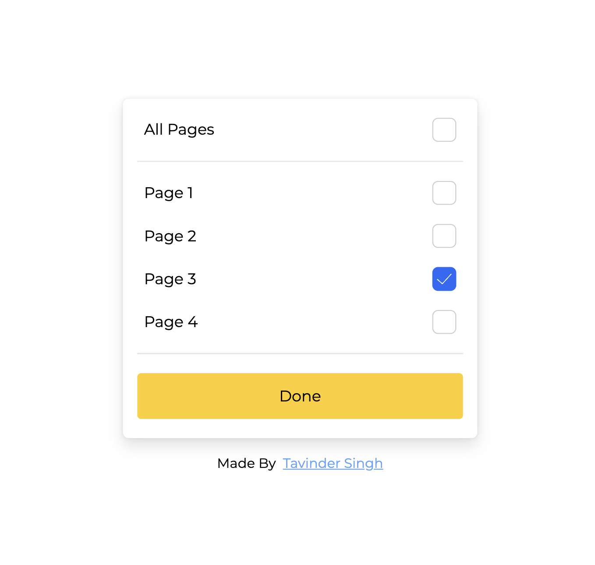

### Install Instructions
1. Clone the repo
2. cd into folder `ellty-first-assignment`
3. Run `npm install` to install all dependencies
4. Run `npm run dev` to start the dev server
5. Open `http://localhost:5173` in your browser

<!-- how do i add the screenshot here -->
### Screenshot

